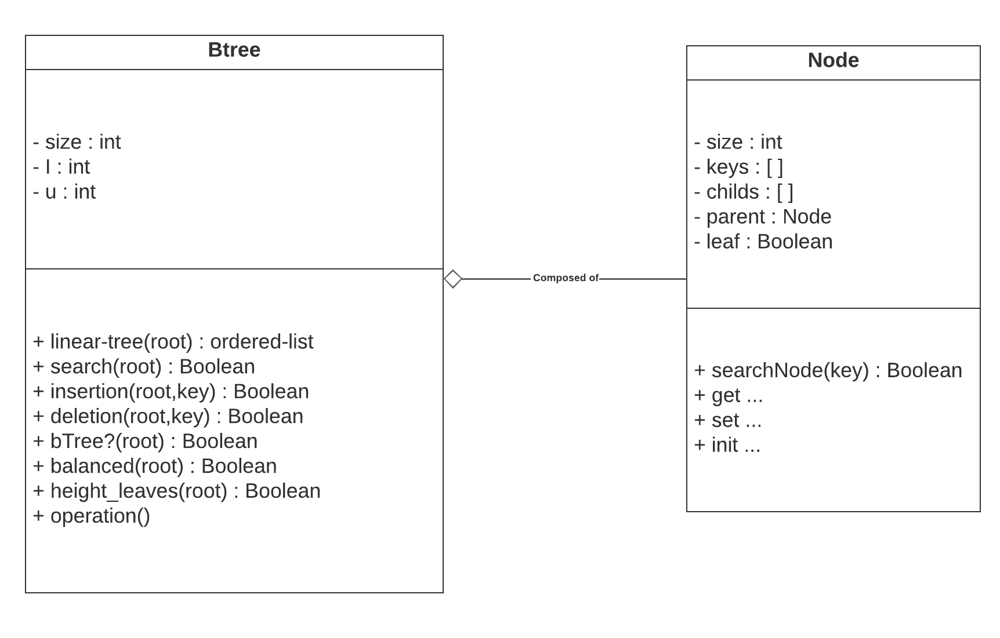

# Projet Python L3S6

## Introdution :

This project consists of simulating a B-Tree. we have to create it, and whenever we add a new value, it has to sort itself automaticaly and place the new key in the right place.

## UML : 

For the moment, i've got this UML : 

It will surely evolve as the project goes on. But the global idea will stay the same by having these 2main classes.

## Presentation : 
All the 3 important methods have been implemented in either BTree class or Node class. About the tests, they are done in the different main files and compared to the result of the website `https://www.cs.usfca.edu/~galles/visualization/BTree.html`. From what i've seen and tested, the BTree is all fine with its insertion and deletion.
